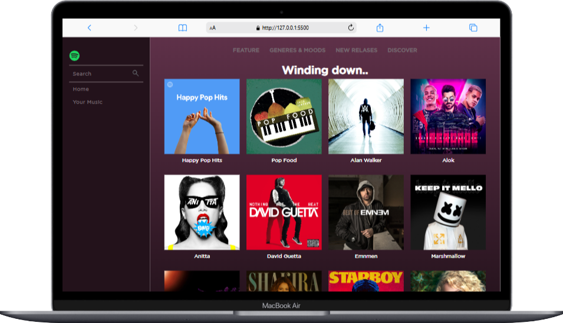

# Cópia do site sopitfy para fins didáticos 

O intuito deste repositório é melhorar as técinas do HTML e CSS, no expoto, foi clonado o site do spotify para fins didáticos 

    

## Site proposto: Spotify

- [x]  Estrutura HTML
- [x] Organizando arquitetura de projetos font 
    - assetes
        - img
        - fonts
- [x] Realizando primeiro commit
- [x] Estilo inicial CSS
    - CSS
        - header
        - main
        - footer
- [x] Realizando segundo commit
- [x] Enviando ao github